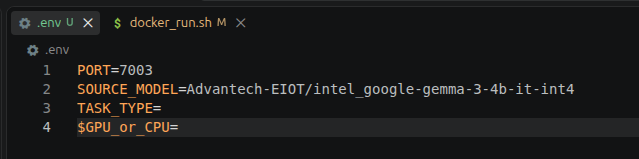
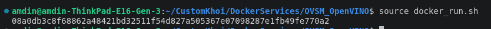

This docker service is executed following this docs:
https://docs.openvino.ai/2025/model-server/ovms_docs_llm_quickstart.html
Source models for OpenVINO: https://huggingface.co/models?library=openvino&sort=trending
                    or more pricisely (recommended): https://huggingface.co/OpenVINO/models

Source models for Text Generation on OpenVINO: https://huggingface.co/models?pipeline_tag=text-generation&library=openvino&sort=trending

**OPTION 1: COMPOSE THE WHOLE BASH/DOCKER SCRIPT AND RUNNING DIRECTLY ON UBUNTU TERMINAL (OR GIT BASH)**
**Run this to create OpenVINO container:**  
Parameters to populate (**you should ask AI to populate them sufficiently**):            
        - depend on your device: <_port_>, <GPU_or_CPU>                                  
        - depend on the model: <model_name_from_hugging_face>, <task_type>               

mkdir models 
docker run --user $(id -u):$(id -g) -d --device /dev/dri --group-add=$(stat -c "%g" /dev/dri/render* | head -n 1) --rm -p <_port_>:<_port_> -v $(pwd)/models:/models:rw openvino/model_server:latest-gpu --source_model <model_name_from_hugging_face> --model_repository_path models --task <task_type> --rest_port <_port_> --target_device <GPU_or_CPU> --cache_size 2

**Example:** 

**OpenVINO/Phi-3.5-mini-instruct-int4-ov** 
mkdir models 
docker run --user $(id -u):$(id -g) -d --device /dev/dri --group-add=$(stat -c "%g" /dev/dri/render* | head -n 1) --rm -p 7000:7000 -v $(pwd)/models:/models:rw openvino/model_server:latest-gpu --source_model OpenVINO/Phi-3.5-mini-instruct-int4-ov --model_repository_path models --task text_generation --rest_port 7000 --target_device GPU --cache_size 2

**llmware/llama-3.1-instruct-ov** 
mkdir models 
docker run --user $(id -u):$(id -g) -d --device /dev/dri --group-add=$(stat -c "%g" /dev/dri/render* | head -n 1) --rm -p 7001:7001 -v $(pwd)/models:/models:rw openvino/model_server:latest-gpu --source_model llmware/llama-3.1-instruct-ov --model_repository_path models --task text_generation --rest_port 7001 --target_device GPU --cache_size 2

**OPTION 2: SPECIFY PORT AND SOURCE MODEL IN .env file, THEN RUN 'source docker_run.sh' (ON UBUNTU TERMINAL (OR GIT BASH))**  
(TASK_TYPE is "text_generation" defaultly, you can specify it particularly due to models 's task type )  
(GPU_or_CPU is "GPU" defaultly, you can specify it particularly due to your device hardware )  
(**you should ask AI to populate them sufficiently**)

(remove the flag -d, if you want to see the log of downloading models and service establishing )
